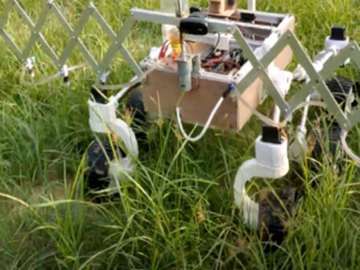
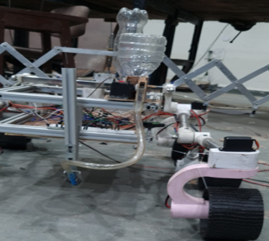
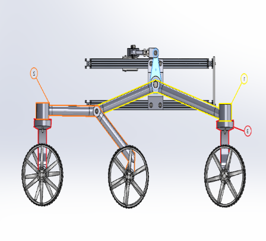
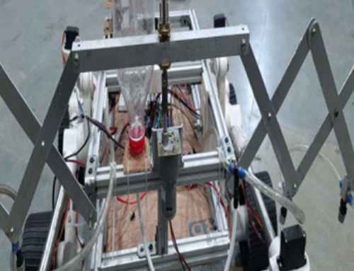
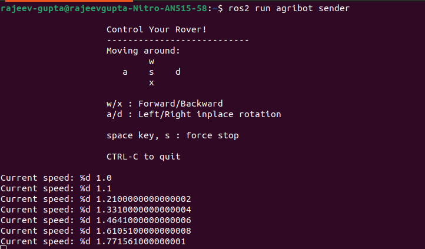

# AGRIBOT
The Agri-Bot is a robot designed to perform several agricultural operations like sowing seeds, spraying weedicides, and detecting disease in crops. Its body is inspired by the space rovers so that it can cover any kind of uneven surface in the field and be lightweight at the same time. The robot was first designed in Solidworks and then built with some parts being 3-D printed and some made with aluminum extrusion rods. It is a six-wheel drive which is steered with the help of four servo motors at the front and the rear wheels. It is operated by RC control and by using ROS2 (humble) to move along the field.

# MAJOR OBJECTIVES

## Cost Effective Alternate: 
Develop the Agribot as an affordable substitute to conventional tractors, significantly reducing the financial burden on farmers compared to the high costs associated with traditional machinery
## Single-Handed Operation: 
Design the Agribot with user-friendly controls and automation features, enabling farmers to operate it single-handedly. This aims to streamline farming operations, minimizing the need for additional labor and reducing operational costs. 
## Precision Seed Sowing: 
Implement precise seed-sowing mechanisms in the Agribot to ensure optimal seed placement, spacing, and depth. This not only enhances efficiency but also contributes to better crop yield and resource utilization. 
## Automated Disease Detection: 
Integrate advanced sensors and imaging technology to enable the Agribot to autonomously detect plant diseases. This addresses the issue of limited knowledge among farmers and facilitates early intervention, preventing the spread of diseases and minimizing crop losses.
## Targeted Pesticide Spraying: 
Equip the Agribot with a targeted pesticide spraying system based on real-time disease detection data. This ensures that pesticides are applied only where needed, reducing environmental impact, minimizing chemical usage, and optimizing crop protection.
## 24/7 work: 
Using Agribot can multiply the working hours by 3 folds, making the job of farmers flexible in time and it will increase their productivity.   
## Greenhouse farming:  
We are aiming to implement Agribot integrated with a 6 DOF robotic arm, in modern greenhouse farms; with the help of sensors, monitoring of the health and vitals of each batch will be done, and our bot can collect the image data for disease detection, hence increasing data collection ability for particular plants. All this will be maintained and computed on the cloud, according to which bot can do selective plant treatment, disease prediction and perform tasks like cutting, grafting, or pruning. Using a robot in greenhouse farming can provide several advantages including a Reduction in Chemical Usage by targeted approaches to crops, Reduced Risk of Contamination with humans, labor efficiency, etc.

# Mechanical features: Rocker Bogie
It is a special suspension system that keeps the robot stable while traversing and ensures that all wheels keep in contact with the ground. Each side has a rocker which is made with four pipes attached with 3-D printed connectors. Both rockers are connected through a differential which moves both rockers in a way such that the chassis remains stable. The special arrangement of the rocker wheels which have the middle and rear wheels freely always moving on a pivot leads to the maximum wheel. 






# Teleoperation via Arduino and Reciver:
Requirements: Arduino, Transmitter and Reciever


The arduino code contains a class of motors which are defined to easily run motors, you just need to change the PWM and DIR pins in the objects of the motors. Once the transmitter and reciever are connected and the code is uploaded, the bot is controlled uisng the reciever. 

# Teleoperation via ROS and SSH:
ROS is installed and implemented via Raspberry pi 4, and the GPIO pins are connected to the motor drivers. The laptop and the raspi are connected under the same wifi and the SSH is done by the command:
```
ssh Username@ip_address
```

The ROS package "agribot" has two control node, the node "sender" is evoked in the laptop and "reciever" is evoked in the raspi terminal. Now we can teleop using the sender node by following the message available on the screen. 


## Sender terminal:
```
ros2 run agribot sender
```

## Receiver terminal:
```
ros2 run agribot receiver
```
